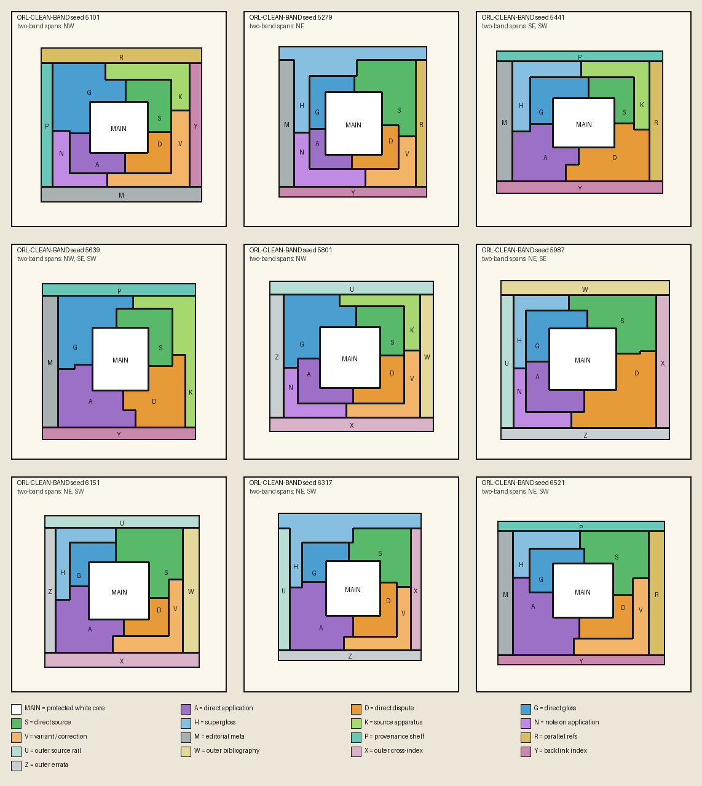

# ascii

**A guided collection of graphics experiments: glyph rendering, CRT effects,
atmospheres, voxel paths, and geometric page layouts.**

This is Tim V's annotated fork of [ngwnos/files](https://github.com/ngwnos/files).
The original repository describes itself as a place to use GitHub like Pastebin.
The source files come from upstream; this fork adds documentation and navigation
to help readers understand what is here and where to start.

It is a study collection, not an installable graphics library or a complete app.
The name `ascii` describes one part of it: a shader that draws an image using
glyphs. The other experiments explore different visual techniques.

## Why explore it?

The interesting thread is **turning visual ideas into explicit machinery**:
choosing glyphs in a shader, representing fog in a 3D grid, finding routes through
voxel geometry, or arranging commentary around a protected central text.

For graphics developers and technical artists, these are concrete implementations
to read alongside their own experiments. For interface designers, the layout
generator offers a different way to think about sources, annotations, and main
content sharing a page.

## Find an experiment

| File | What it explores | Where the value is |
|---|---|---|
| [asciiMaterial.ts](asciiMaterial.ts) | Three.js node material using a glyph atlas, source textures, gradient signals, and optional ramp dithering | Start here to study image-to-glyph rendering in a GPU material. The host must supply textures and uniforms. |
| [CRTScreenScene.ts](CRTScreenScene.ts) | A configurable CRT-style scene with screen sources and shader effects | Study how screen content and display effects are assembled; external media and host integration are separate concerns. |
| [BioluminescenceScene.ts](BioluminescenceScene.ts) | Particles, lighting, bloom, and volume effects | Explore how several techniques combine into a luminous scene. Its parameter module is missing. |
| [PlanetScene.ts](PlanetScene.ts) | Planet rendering with atmospheric scattering controls | Read how atmosphere parameters feed rendering. Its parameter module is missing. |
| [BoxFroxelPipeline.ts](BoxFroxelPipeline.ts) | A volumetric fog pipeline using a 3D texture | Study a froxel: a cell in a camera-oriented volume grid. External grid constants are missing. |
| [voxelPathfindingWorker.ts](voxelPathfindingWorker.ts) | Worker-based path construction through voxel geometry, including A* | Study grid representation, route search, and transferable result buffers. A host must construct the input grid. |
| [orl_clean_band_generator.py](orl_clean_band_generator.py) | Seeded geometric layouts with rectangular bands and L-shaped annotation regions | Explore main text surrounded by glosses, sources, references, and editorial apparatus; exports PNG, SVG, and JSON. |

Two PDFs are also retained from upstream. Their filenames alone do not establish
authorship, provenance, or permission to reuse their contents.

## In action: geometric page layouts

Actual output from `orl_clean_band_generator.py`: nine seeded arrangements of
main content, glosses, sources, disputes, and outer reference material. These
are geometric regions, not pages of typeset text. The source is upstream work.
See the [capture and reproduction notes](docs/previews/README.md),
[vector output](docs/previews/orl-layouts.svg), and
[layout data](docs/previews/orl-layouts.json).

The other six experiments do not yet have verified captures in this fork.
The graphics snippets need a browser host (and several need missing modules);
the pathfinding worker needs a host and a visualization. No substitute images
are presented as screenshots of those implementations.

## Start here

1. Pick one technique from the table; the files are not one application.
2. Read the [integration notes](docs/INTEGRATION.md) for its dependencies and missing pieces.
3. Resolve permissions before incorporating source into another project.

There is no `package.json`, pinned Three.js version, browser entry point, or
complete scene dependency tree in this snapshot. A fresh clone therefore has no
supported `npm install` / `npm run dev` workflow. The Python generator also has
external dependencies and a fixed output path, documented in the notes.

## What this fork adds

- A plain-language map of the experiments and their practical uses.
- An integration checklist that distinguishes source snippets from runnable demos.
- Explicit upstream attribution and an honest account of the collection's limits.

The rendering and pathfinding implementations remain upstream work. No visual,
performance, or production-readiness claims are made by these documentation changes.

## Attribution and permissions

Original collection: [ngwnos/files](https://github.com/ngwnos/files).
The documentation pass starts from fork commit
[`7d471e2`](https://github.com/ordokr/ascii/tree/7d471e21bb30db6fa36b5ddaabaca8fbbe7f95fe).

No repository-wide license is present in that snapshot. Public availability is
not a grant of reuse rights. Confirm permission with the relevant rights holders
before copying, modifying for redistribution, or shipping these sources or PDFs.
This fork does not assign a license to upstream material.

## Support the work

If these explanations help you understand a technique or save time exploring the
collection, consider [sponsoring my work](https://github.com/sponsors/ordokr).
Your support helps sustain my documentation, curation, and independent development.

Sponsorship here supports my work on this fork; it does not imply that I authored
the upstream experiments or provide a license to their contents. Please also
credit the original authors when discussing their work.

Thank you for helping make useful technical ideas easier to understand.

Tim V
